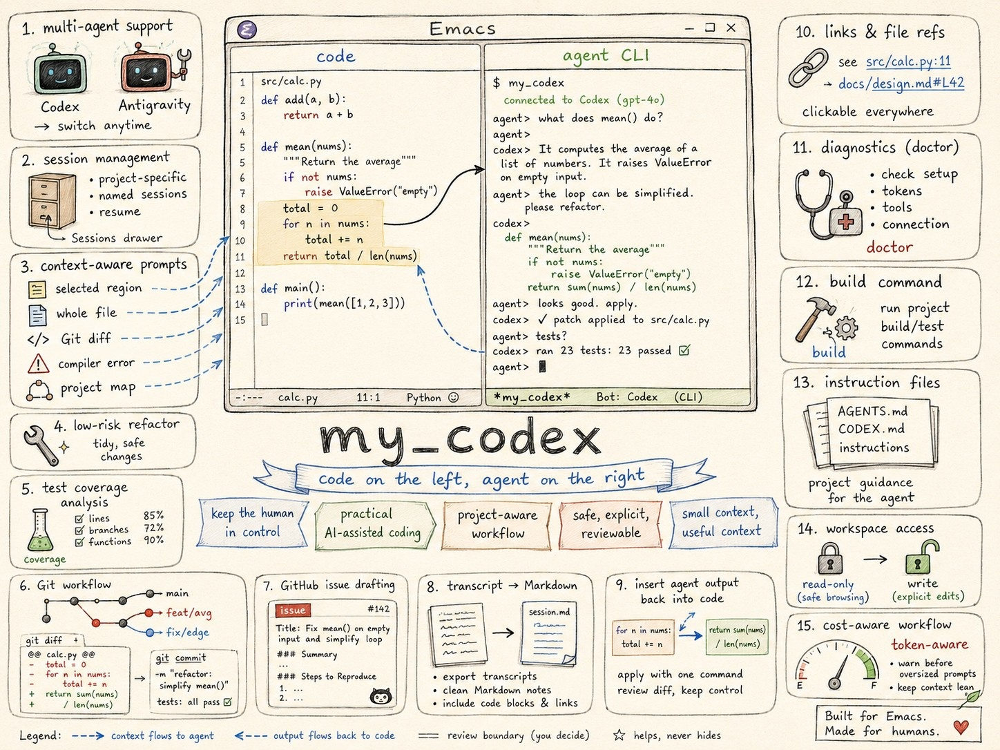

[][releases]


[][mpl2]



# my-codex.el

```text
┌───────────────┬───────────────┐
│ code          │ agent CLI     │
│ 1  </>        │ >_            │
│ 2  ─────      │ ─────────     │
│ 3  ───────    │ ─────         │
│ 4  }          │ ▌             │
└───────────────┴───────────────┘
```

`my-codex.el` runs the Google Antigravity CLI (`agy`) or OpenAI Codex CLI (`codex`) inside an Emacs terminal backend. `vterm` is the default backend on systems that support it; `eat` is the default on Windows.

> [!NOTE]
> The package is named `my-codex.el` because it initially supported only the OpenAI Codex CLI. It has since been expanded to support Google Antigravity as a first-class agent.

It keeps your code on the left and the active agent CLI on the right, providing helpers for regions, files, Git diffs, compiler errors, build commands, and commit messages. Agent buffers are project-specific, keeping separate sessions per project.

## Features

- **Multi-Agent CLI Support**: start, resume, and manage sessions with Google Antigravity or OpenAI Codex, with granular workspace write-access control.
- **Side-by-Side Layout**: code on the left, interactive agent terminal on the right.
- **Context-Aware Prompts**: send regions, files, Git diffs, compiler errors, or project structure overviews directly to the agent.
- **Refactoring & Coverage**: draft low-risk refactoring plans for file ranges and analyze implementation files against tests for missing coverage.
- **Integration Tools**: export session transcripts, summarize conversations into Markdown notes, and draft commits or GitHub issues directly from Emacs.
- **Interactive UI**: insert agent output back into your code, and open clickable file references and URLs directly from the terminal.
- **Diagnostics**: verify Emacs, agent binaries, the selected terminal backend, and Git availability using the `my-codex-doctor` health check.

The package treats token cost as part of the workflow: it limits generated
project context, warns before oversized prompts, references saved project-file
regions by file and line range, and checks for Codex CLI settings that affect
costs and retained context.

## Requirements

- Emacs 29.1 or newer.
- [`vterm`][vterm] for the default terminal backend on supported systems.
- [Eat][eat] for Windows, or when selected with `my-codex-terminal-backend`.
- [`transient`][transient].
- Google [Antigravity CLI][agy] and/or OpenAI [Codex CLI][codex].
- Git (for Git commands) and GitHub CLI `gh` (for issue creation).

`vterm` is optional at package-install time and is loaded lazily only when a vterm-backed agent session is started. Eat is loaded only when the Eat backend is selected.

## Installation

Clone the repository and add it to your Emacs load path:

```elisp
(add-to-list 'load-path "~/.emacs.d/lisp/my_codex")
(require 'my-codex)
(my-codex-global-mode 1)
```

## Key Bindings & Usage

Press `F8` to open the agent command menu.

### Common Workflows

Review current changes:

- `F8 g r f` : review the current file's Git diff.
- `F8 g r s` : review staged changes.
- `F8 c` : draft or reuse an agent-generated commit message, edit it, then commit.

Ask about code:

- Select a region, then press `F8 s` to send it to the agent.
- Put point inside a function, then press `F8 x f` to review the current defun.
- Put point on a symbol, then press `F8 x s` to explain it.

Control token usage:

- `F8 y` : copy a file-and-line reference instead of sending file contents.
- `F8 S h` : start a fresh handoff session from a compact context transfer.
- `F8 S k` : compact the current session context when supported by its agent profile.

Use the session dashboard with `F8 S l` to see active and inactive agent
sessions in one place. It shows agent, project, session, access mode, process
state, Git branch/state, prompt count, buffer lines, age, and last activity.

### Session Management
- `F8 o` / `F8 w` : start/show the default read-only or workspace-write session.
- `F8 S o` / `F8 S w` : select an agent, then start its default read-only or write session.
- `F8 S n` : start or show a named session with a selected agent and access mode.
- `F8 S h` : ask the active session for a compact handoff and start a fresh named session containing only that handoff.
- `F8 S k` : compact the active session context when supported by its agent profile.
- `F8 S l` / `F8 S q` : open the session dashboard, or hide the selected session window.
- `F8 S r` / `F8 q` : resume a previous session, or hide the active agent window.

### Prompts & Refactoring
- `F8 a` / `F8 A` : ask a free-form question or open the customizable prompt preset menu.
- `F8 s` / `F8 r` : send the selected region, or draft a low-risk refactoring plan for it.
- `F8 Right` : send the selected region when active, otherwise inspect the current file.
- `F8 Left` / `F8 TAB` : insert agent text into code, or toggle focus between code and agent.
- `F8 x f` / `F8 x F` / `F8 x c` : review the current defun, inspect the current file, or analyse test coverage. The agent finds relevant tests; use `C-u F8 x c` to select one explicitly.
- `F8 x s` / `F8 e` : explain the symbol at point or selected error.
- `F8 y` : copy a file-and-line reference for the selected region or current line.

### Document Workflow (Markdown/Org contexts)
Only active in document buffers (e.g. Markdown, Org, txt):
- `F8 d b` : use the current document or region as the primary task brief.
- `F8 d i` : ask the active agent to implement the selected plan.
- `F8 d r` : ask the active agent to review the plan.
- `F8 d q` : extract open questions from the document.
- `F8 d s` : ask the active agent to summarise the document.
- `F8 Right` : inspect the current document instead of code files.

### Git & GitHub Workflow
- `F8 g r a` / `F8 g r s` / `F8 g r f` : review all changes, staged changes, or the current file's Git diff.
- `F8 g v` / `F8 g V` : view the current or staged Git diff locally.
- `F8 g d` / `F8 g D` : ediff the current or a changed file against `HEAD`.
- `F8 c` : draft or reuse an agent-generated commit message, edit it, then commit.
- `F8 M` : summarize the session to Markdown notes.
- `F8 t l` / `F8 t d` : list open GitHub issues, or draft a GitHub issue from the session.

### Diagnostics, Build & Instructions
- `F8 i` : open project instruction files (e.g., `AGENTS.md`, `CODEX.md`, `.codex/instructions.md`).
- `F8 T` : open infrequent tools, including project overview, diagnostics, session export, and doctor.
- `F7` : run the project build command.

## Customisation

Configure options via `M-x customize-group RET my-codex RET`.

```elisp
;; Set the default agent profile
(setq my-codex-agent 'antigravity)

;; Define or replace an agent profile
(my-codex-define-agent
 'example
 :label "Example"
 :buffer-prefix "example"
 :commands '((read-only . "example --read-only")
             (workspace-write . "example")
             (resume . "example resume"))
 :instruction-files '("EXAMPLE.md")
 :instruction-strategy 'root-all
 :file-reference-format "%s")

;; Layout & build commands
(setq my-codex-right-width 80)
(setq my-codex-project-build-command "./setup_build")

;; Prompt & warning thresholds
(setq my-codex-enable-prompt-preview t)
(setq my-codex-region-send-policy 'prefer-reference)
(setq my-codex-prompt-warning-tokens 4000)
(setq my-codex-warn-about-unsaved-project-buffers t)
```

## Updating CLI binaries

### Antigravity CLI

The Antigravity CLI (`agy`) has a built-in self-updater. Run the following command to update:

```sh
agy update
```

### Codex CLI

This repository includes optional helper scripts for updating direct GitHub binary installations of Codex CLI:

```sh
./scripts/update-codex.sh
```

On Windows, run from PowerShell:

```powershell
.\scripts\update-codex.ps1
```

The scripts are intentionally conservative. They only update installations where the active `codex` command points to a direct binary downloaded from the OpenAI Codex GitHub releases, and they refuse common package-manager or wrapper installations such as npm, Homebrew, Snap, Flatpak, Scoop, Chocolatey, or winget. If you installed Codex with a package manager, update it with that package manager instead.

Depending on where `codex` is installed, the Linux script may ask for `sudo`. On Windows, close running Codex sessions first and use an elevated PowerShell session if the destination directory requires administrator rights.

## Companion Skills

The `skills/` directory contains optional agent skills that complement this package. They are provided as editable source, are not installed automatically, and are not required for the Emacs package to work.

Expert users can copy, symlink, modify, or ignore them according to their own agent setup.

Example invocations:

| Skill | Description | Example invocation |
| --- | --- | --- |
| `consilium` | Codebase advisor and plan manager. Finds improvements and writes implementation plans. | `$consilium audit codebase` |
| `grill-me` | Stress-test a plan or design by asking focused questions one at a time. | `$grill-me stress-test this refactoring plan` |
| `handoff` | Create a disposable Markdown context transfer for continuing focused work in another agent session. | `$handoff continue the Firebird SQL refactoring` |

Attribution:

| Skill      | Attribution    | Reference |
| ---        | ---            | ---       |
| `grill-me` | Matt Pocock    | [grill-me: Stress-Test a Plan Before You Build][aihero-grillme] |
| `handoff`  | Matt Pocock    | [handoff: Move Context Between Agent Sessions][aihero-handoff] |

## Licence

[Mozilla Public License v2.0][mpl2], also available in [LICENSE][license].

## References

> Now code is free!
>
> No it isn't: the consequences of your actions will eventually hit you and if you think that any amount of code is good now... you just delayed the punishment.

- [The Pragmatic Programmer](https://en.wikipedia.org/wiki/The_Pragmatic_Programmer) - a timeless classic, even more relevant in the age of AI coding.
- [Critical Thinking Habits for Coding with AI](https://www.oreilly.com/library/view/critical-thinking-habits/0642572243326/)


[agy]: https://antigravity.google/product/antigravity-cli
[aihero-grillme]: https://www.aihero.dev/skills-grill-me
[aihero-handoff]: https://www.aihero.dev/skills-handoff
[codex]: https://github.com/openai/codex
[eat]: https://elpa.nongnu.org/nongnu/eat.html
[license]: https://github.com/morinim/my_codex/blob/main/LICENSE
[mpl2]: https://www.mozilla.org/MPL/2.0/
[releases]: https://github.com/morinim/my_codex/releases
[transient]: https://github.com/magit/transient
[vterm]: https://github.com/akermu/emacs-libvterm
